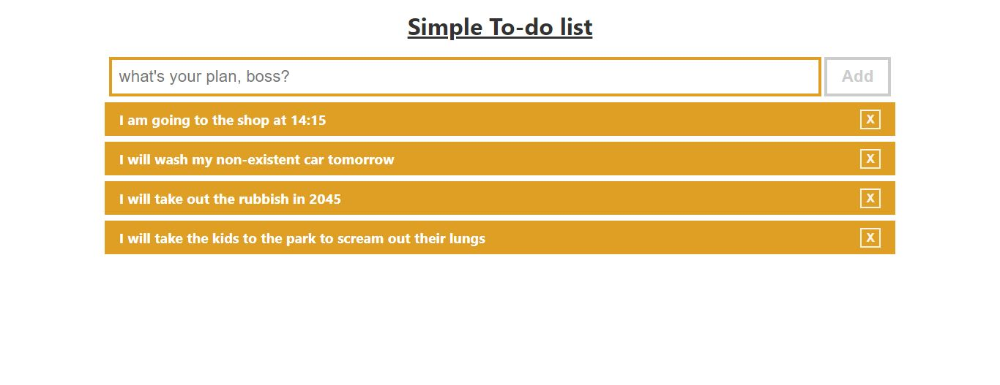

# Simple-To-do-list

## About

It is able to list tasks by clicking on the "Add" button and completed tasks can be removed with the "X" button.
As it is a simple app, don't expect validation.

## Live Demo

Please don't judge. I was simply bored when I came up with the example tasks. 

